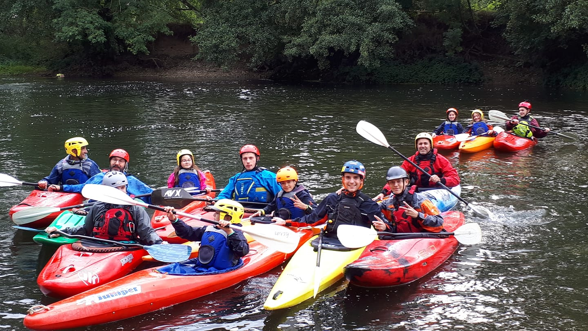

Pour nous rejoindre, la méthode la plus simple est de nous contacter sur 
[Facebook](https://fr-fr.facebook.com/pages/alnm-section-kayak/138730189506306), mais vous pouvez 
aussi tout simplement venir au club le samedi après-midi, en début ou en fin de 
séance (13h30 ou 17h).

Les inscriptions sont valables sur une année civile (de janvier à décembre); mais 
il est possible de commencer en septembre, ou en cours d'année.

Quels sont les modalités d'inscription ?
 * Il faut [savoir nager 25m et pouvoir s'immerger](assets/docs/aisance_aquatique.pdf)
 * Avoir 9 ans minimum.

Il faudra fournir les documents suivant :
 * Le questionnaire de santé: [pour les mineurs](assets/docs/QS_Sport_mineurs.pdf) et [pour les majeurs](assets/docs/QS_Sport_majeur.pdf)
 * Si besoin, un [certificat médical](assets/docs/Modele-certificat-médical.pdf) de non contre-indication à la pratique du kayak.
 * La [fiche d'inscription](assets/docs/adhesion.pdf) remplie et signée.

### Cotisation 2023 :

La cotisation inclue la licence FFCK et l'adhésion au club.

|:------- |:---:|
 Adultes   | 120&nbsp;€ |
 Jeunes (moins de 18 ans) | 90&nbsp;€ |

### Infos pratiques

Avant de s'engager, il est possible de faire un essai : 
nous vous proposons une formule carte découverte&nbsp;; vous venez en début de séance
(voir sur facebook, ou nous contacter) avec l'équipement adéquat (maillot de bain,
 vieilles chaussures (sans lacet), k-way, serviette) pour naviguer, et c'est parti !
Pas besoin de rendez-vous, il suffit d'être à l'heure.

Si vous voulez commencer pendant la période hivernale (de novembre à mars), vous
aurez la possibilité de faire un essai en piscine.

Pour tout renseignement, n'hésitez pas à nous contacter.

