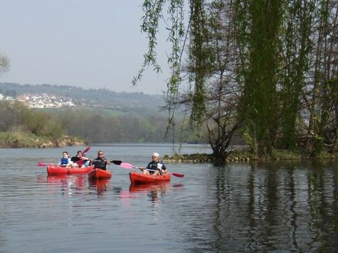
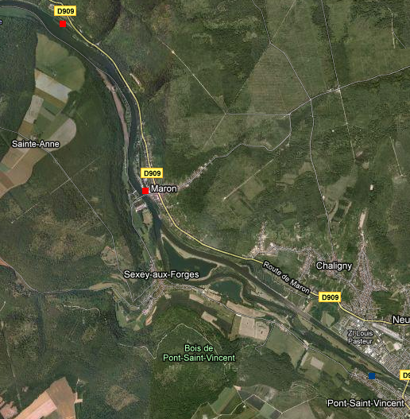

### Envie d'un moment de détente, d'aventure et de convivialité ?

ALNM Canoë-Kayak vous propose des parcours à la journée, en location libre sans encadrement. 
Dans le cadre sauvage et calme des boucles de la Moselle, à partir de Pont st Vincent, vous 
évoluerez selon vos envies en toute sécurité.

 
### Deux parcours vous sont proposés:

Dans tous les cas le [départ](https://www.google.fr/maps/place/ALNM+Cano%C3%AB-Kayak/@48.6080411,6.091914,17z/data=!3m1!4b1!4m5!3m4!1s0x4794a105f4366c43:0xb87dbefc25c04772!8m2!3d48.6080411!4d6.0941027) s'effectue à Pont-Saint-Vincent où vous sera remis le matériel (bateaux, gilets, pagaies et bidons étanches). Deux arrivées sont ensuite possibles:

 * Arrivée Maron, 6 km (soit environ 2 heures).
 * Arrivée les fonds de Monvaux, 9 km (soit environ 3 heures).

Le retour est assuré en camionnette 9 places.

### Tarifs

Les paiements devront se faire en espèces, par chèque ou chèques vacances.

*Attention, nous ne sommes pas en mesure d'accepter les paiements par carte bancaire*.

|:-------------- |:----:|
Bateau monoplace | 16€  |
Bateau biplace   | 26€  |

### Infos pratiques

En avril, mai, juin et septembre :
Ouvert toute la semaine + les week-end sur réservation.

En juillet et août :
Ouvert tous les jours avec ou sans réservation.

Le reste de l'année :
Uniquement sur réservation et selon la disponibilité des bénévoles.

Horaires de départ:
 * De 10h00 à 16h30.
 * À partir de 9h00 sur réservation.

 

Renseignements et réservations:
Tel: 06 82 18 02 62

